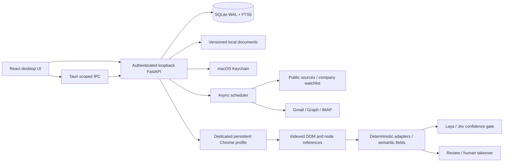

# Meridian — local job search workspace

Architecture decision, 29 September 2026. The product name is configured in desktop metadata and backend settings. Requirements: [original specification](docs/PRODUCT_REQUIREMENTS.es.md).

## Deployment and boundaries

Meridian is a Tauri 2 macOS application with a React/TypeScript/Vite UI and a Python 3.12 FastAPI sidecar packaged with PyInstaller. No hosted service is required. Tauri launches the sidecar on loopback with a random per-launch bearer credential, conveys its connection details through a scoped Rust command, and terminates its child on exit. Browser access in development uses an explicit token. The server validates both authentication and browser origins. Documents and external HTML are treated as untrusted input. There is no telemetry.

## Storage

Production root: `~/Library/Application Support/Meridian/`. Children: `database`, `documents`, `browser-profile`, `cache`, `logs`, `backups`, `models`. Development/tests may set `MERIDIAN_DATA_DIR`. SQLite connections enforce foreign keys, WAL, busy timeout. Alembic versions the schema. Database transactions protect unique canonical job identities and one application per job. Jobs retain source aliases and immutable snapshots; application events are append-only. Document versions use content hashes and immutable files. All secrets are stored in macOS Keychain, never database rows. Backups use authenticated encryption and exclude browser profiles/secrets.

Entity groups: candidate/facts/education/experience/projects/skills/relationships/preferences/answers; companies/domains/watch rules; jobs/source aliases/skills/snapshots/matches/duplicates; applications/events/answers/documents/emails; messages/classifications; automation runs/steps/human tasks; search profiles/sources/scheduler tasks; settings/integrations/secret references. Structured JSON is used for extensible source payloads and rule expressions, not as a substitute for indexed relationships.

## Discovery and matching

Source → fetch → normalize → canonical URL/ATS identity dedupe → snapshot → explainable weighted score → search profile filters → shortlist. Public ATS APIs are preferred. HTML ingestion uses JSON-LD JobPosting and semantic HTML. Restricted platforms open in the dedicated browser for user interaction; they do not get stealth automation. Polling is bounded and sources expose health/errors. Unknown salary, seniority or work authorization remains unknown. Matching combines normalized terms and an explicit semantic vocabulary; optional local model providers remain replaceable. Missing skills lower fit but do not silently reject unless an explicit user filter requires it.

## Browser execution

Snapshot controls atomically into indexed tables; retain actual element handles and document/page identities. Only enumerated operations on observed targets are permitted. Revalidate node attachment, visibility, enabled state, obstruction and document freshness immediately before acting. A new snapshot invalidates old decisions. Frames are individually observed; file upload resolves only registered immutable document versions. Laya and Jev select operation/target, never selectors, JavaScript or text answers. Text generation is a separate, evidence-constrained service.

Hierarchy: deterministic ATS semantics → generic accessible labels → configured Laya/Jev → human. Optional vision is outside the default execution path. Each ATS declares its capabilities honestly; complex or restricted forms escalate instead of claiming success. CAPTCHA/MFA blocks require manual completion. A submission requires independent visible confirmation or a linked confirmation email. An interrupted or uncertain submission is never blindly retried.

Manual prepares only. Review fills and pauses before any submit. Auto additionally requires verified answers, no sensitive questions, approved domain, score/confidence/rate limits and no duplicate. Global pause is checked before every browser action. Review approval is bound to the current snapshot and current answers/documents. Human takeover invalidates stale observations. No real job submission is used for tests.

## Email and status

Read-only Gmail OAuth, Microsoft Graph OAuth and IMAP over TLS use Keychain credentials. Providers fetch incrementally and deduplicate by provider/message ID. Classification extracts evidence, links conservatively using application ID/company/role/thread, and creates a human task for ambiguity. Confident classification creates an event and updates status with progression guards; late confirmations cannot regress an interview. Deadlines preserve source text/timezone. No email sending is implemented implicitly.

## Failure and privacy model

Network errors are surfaced per source/integration and retries use bounded backoff. Background work cannot crash the UI. A run checkpoint records progress, never cookies or authentication headers. On restart, running operations become interrupted human-review items. Facts imported from CVs start unverified; only explicit verification/locking permits automatic use. Sensitive questions require an explicit policy. Text model outputs must cite existing verified fact IDs and remain drafts until reviewed where factual support is uncertain. Local inference is preferred; configured remote providers clearly disclose their data boundary.

## Verification and packaging

Unit tests cover normalization, matching, dedupe, answers, email classification and gates. Integration tests cover SQLite persistence/migrations, documents, email linking and HTTP authorization. Browser tests use local ATS fixtures only, including uploads, multiple steps, stale nodes and confirmation. Frontend typecheck/lint/build and Rust checks precede an unsigned `.app`/`.dmg`. End-to-end live account verification requires the user's own login/OAuth authorization; a local test is never represented as a real recruitment submission.
